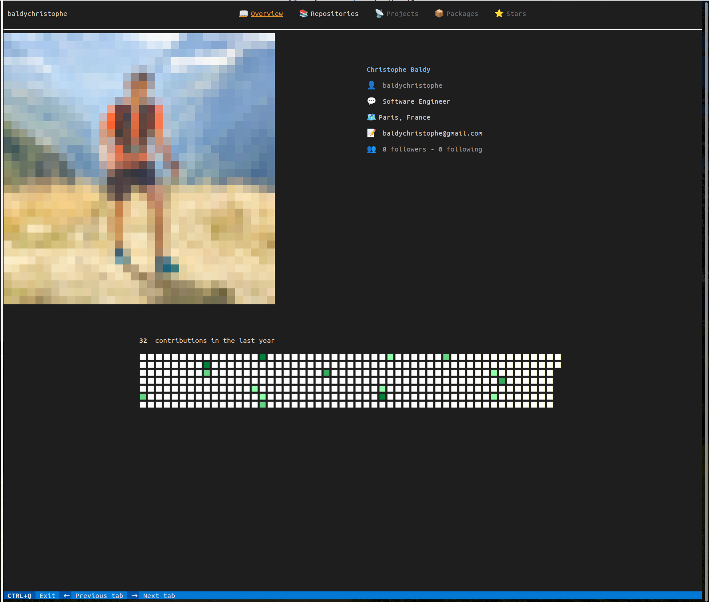
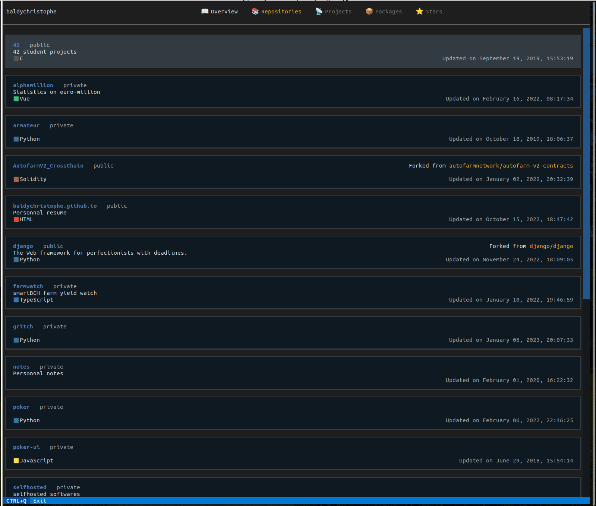
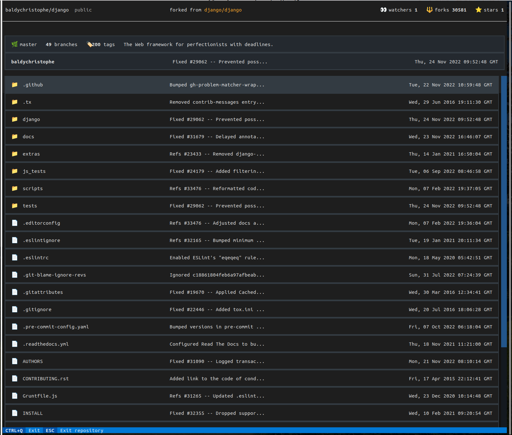
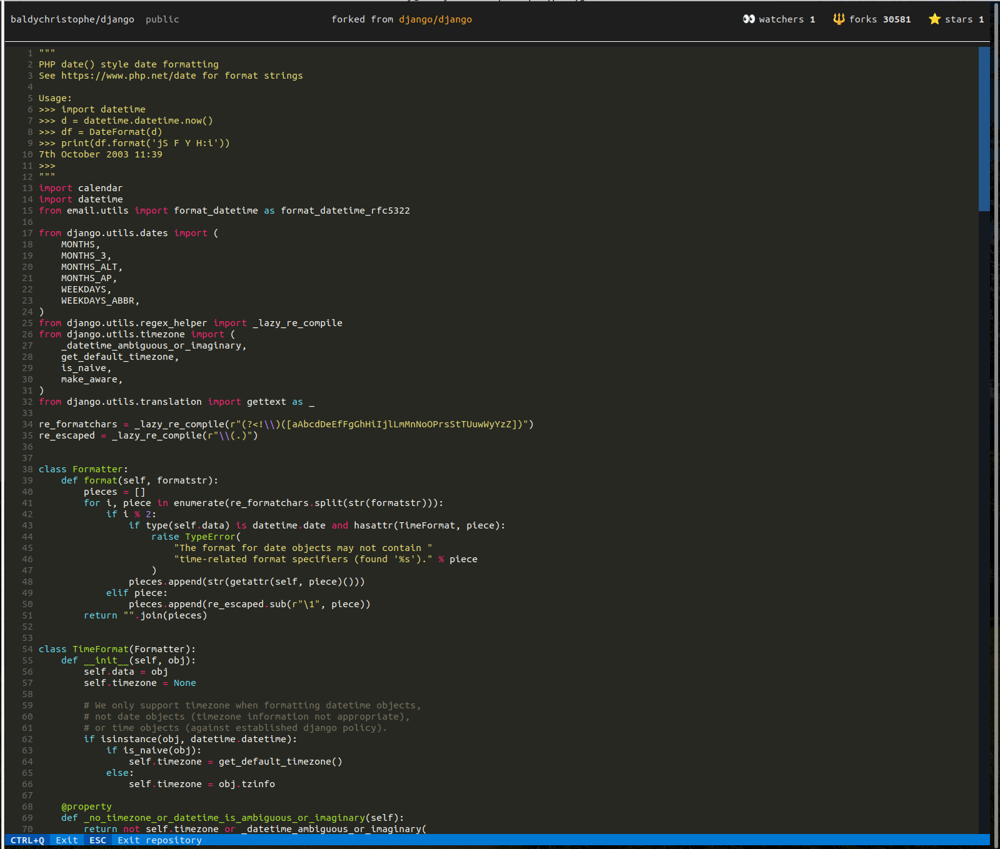

# gritch

Gritch is a prototype [textual](https://textual.textualize.io/)-based application aiming to replicate github in a terminal.

> **Note**: The application was made with the very early `0.8.0` version of textual

it can be run in a terminal to access the personal profile page of a user, browse its repositories 
and their content.

It was developped primarily to assess the possibilities of the framework `textual` and learn how to use it, 
as a personal curiosity.

## Screenshots

### User profile page


### List of repositories


### Inside a repository


### Read a file


## Usage
- Install the dependencies:
```commandline
pip install -e . -r requirements.txt
```

- For the authentication with github's API, you will need an access token 
  that can be generated [here](https://github.com/settings/tokens)

- Then declare the token as an environment variable
```commandline
export GIT_ACCESS_TOKEN=<the-token>
```

- Start the application
```commandline
gritch
```
